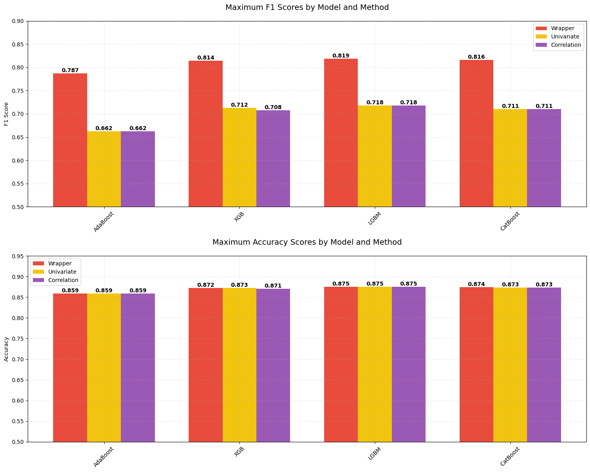
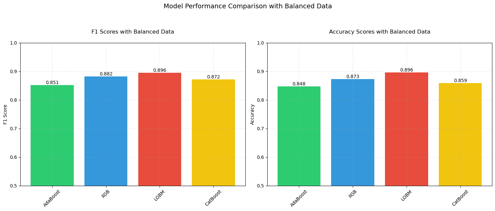
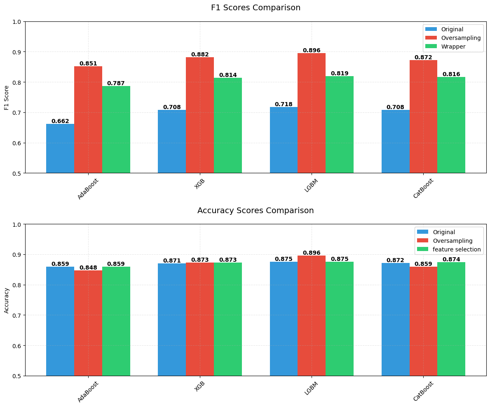

# Personal-Annual-Income-Forecast

## Overview
The first part evaluates and compares the performance of various boosting algorithms combined with different feature selection methods for classification tasks. The analysis focuses on handling imbalanced data and optimizing model performance through feature engineering.
The Second part address the challenge of imbalanced datasets by using method like synthetic data generation techniques (SMOTE) & Applying class weights.

## Models and Methods

### Boosting Algorithms
- AdaBoost
- XGBoost (XGB)
- LightGBM (LGBM)
- CatBoost

### Feature Selection Methods
1. **Wrapper Method (RFE)**
   - Recursive Feature Elimination
   - Best overall performance across models
   - Optimal feature subset selection

2. **Univariate Selection**
   - Statistical feature importance testing
   - Strong performance with XGBoost
   - Feature ranking based on statistical metrics

3. **Correlation-based Selection**
   - Feature correlation analysis
   - Redundancy reduction
   - Multicollinearity handling

### Imbalanced Data Handling
- SMOTE (Synthetic Minority Over-sampling Technique)
- Class weight balancing
- Performance evaluation on balanced datasets

## Performance Analysis

### Evaluation Metrics
- **F1 Score**: Harmonic mean of precision and recall
- **Accuracy**: Overall classification accuracy

### Model Performance Results(Feature selection)

#### AdaBoost
- F1 Score: 0.7872 (Wrapper)
- Accuracy: 0.8589 (Wrapper)

#### XGBoost
- F1 Score: 0.8144 (Wrapper)
- Accuracy: 0.8726 (Univariate)

#### LightGBM
- F1 Score: 0.8188 (Wrapper)
- Accuracy: 0.8752 (Wrapper)

#### CatBoost
- F1 Score: 0.8160 (Wrapper)
- Accuracy: 0.8741 (Wrapper)

### Model Performance Results(Balanced Data)

#### AdaBoost
- F1 Score: 0.8515
- Accuracy: 0.8476

#### XGBoost
- F1 Score: 0.8820
- Accuracy: 0.8727

#### LightGBM
- F1 Score: 0.8955
- Accuracy: 0.8958

#### CatBoost
- F1 Score: 0.8719
- Accuracy: 0.8588

### Best Overall Performance
- **Highest F1 Score**: LGBM with Balanced Data (0.8955)
- **Highest Accuracy**: LGBM with Balanced Data (0.8958)

## Visualization Components
1. **Performance Comparisons**
   - Model-wise performance metrics
   - Feature selection method effectiveness
   - Original vs balanced data results

2. **Feature Analysis**
   - Feature importance rankings
   - Selection method comparisons
   - Performance improvement tracking

3. **Statistical Analysis**
   - Method comparison statistics
   - Performance improvement metrics
   - Significance testing results

## Key Findings
1. Wrapper method (RFE) consistently outperformed other feature selection techniques
2. LightGBM showed superior performance across metrics
3. Data balancing significantly improved model accuracy
4. Data balancing enhanced model robustness

## Future Enhancements
- Advanced feature selection algorithms
- Cross-validation implementation
- Hyperparameter optimization
- Additional performance metrics
- Ensemble method exploration

## Required Libraries
- numpy
- pandas
- scikit-learn
- matplotlib
- xgboost
- lightgbm
- catboost
- imbalanced-learn

## Contact Information

### Project Maintainer
- **Name**: HaoLin Chiang
- **Email**: alexjiang151@gmail.com
- **GitHub**: [github.com/beas28la](https://github.com/beas28la)
- **LinkedIn**: [linkedin.com/in/hao-lin-ch](https://www.linkedin.com/in/hao-lin-ch/)
